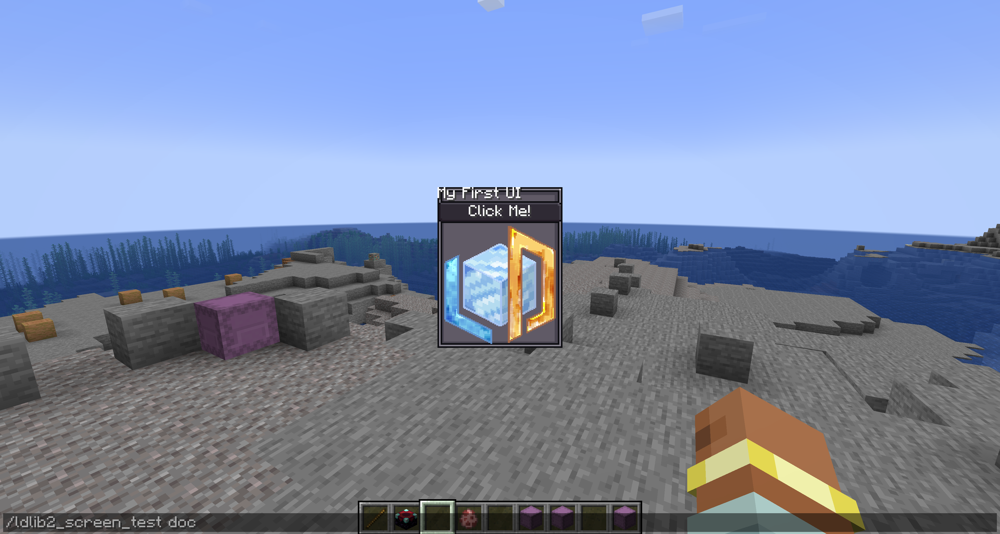
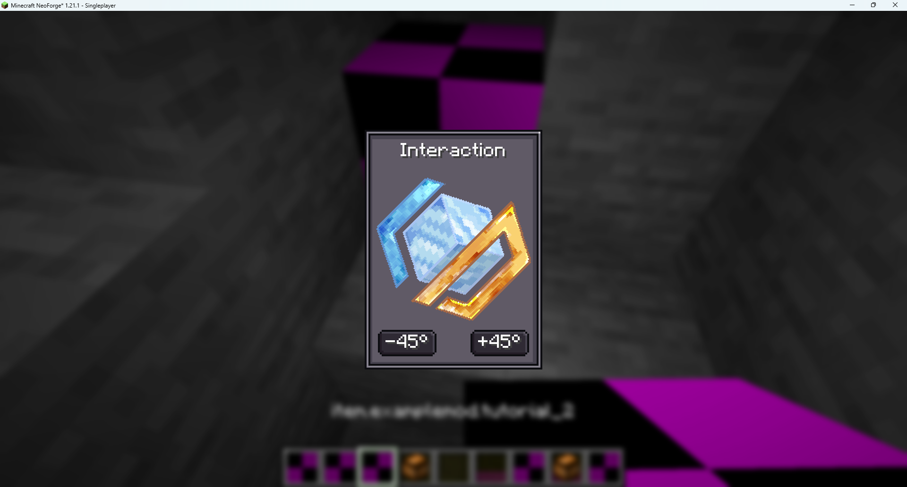
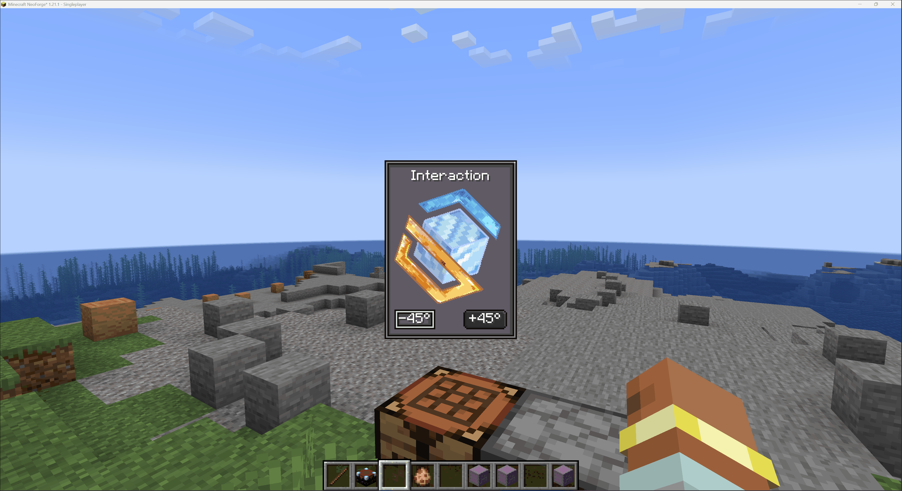
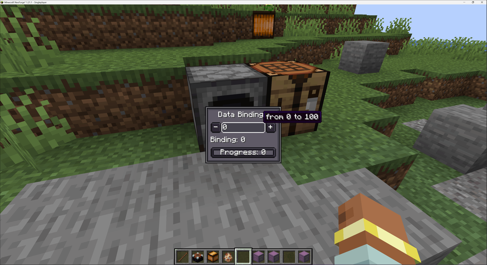
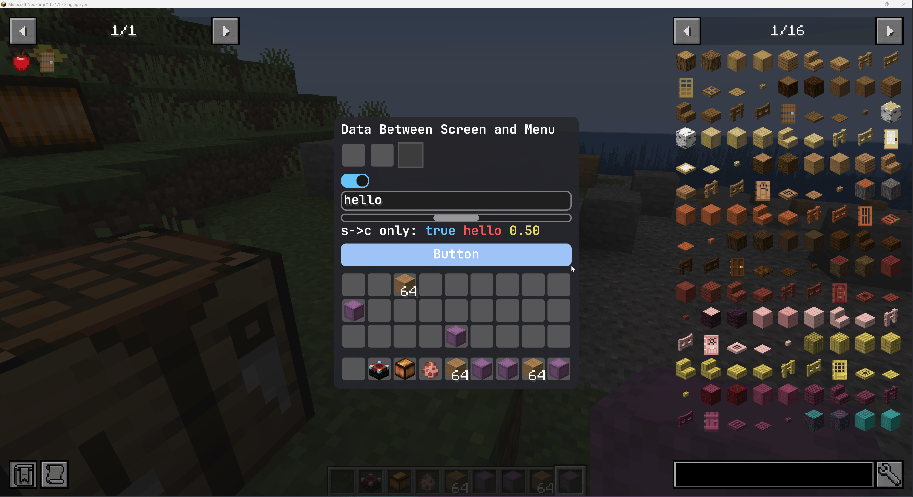

# LDlib2 是什么？

这个视频已经介绍的很清晰了，这里就不在过多说了。
https://www.bilibili.com/video/BV1fzvDBhEBV/?spm_id_from=333.1365.list.card_archive.click


这是wiki地址：
https://low-drag-mc.github.io/LowDragMC-Doc/ldlib2/java_integration/

这里的内容也大多来自wiki

# 安装

安装也很简单。
```groovy
repositories {
    // LDLib2
    maven { url = "https://maven.firstdark.dev/snapshots" } 
}

dependencies {
    // LDLib2
    implementation("com.lowdragmc.ldlib2:ldlib2-neoforge-${minecraft_version}:${ldlib2_version}:all") { transitive = false }
    compileOnly("org.appliedenergistics.yoga:yoga:1.0.0")   
}

```

# 快速开始

## tutorial 1：创建一个展示ModularUI
ModularUI 是UI的运行时管理器 -- 处理生命周期和交互。
接受一个UI 实例和一个可选的玩家作为输入。

[Tutorial1UIContainer.java](../../src/main/java/com/example/examplemod/gui/tutorial/Tutorial1UIContainer.java)
```java
// 定义一个用于演示基础 UI 容器的类
public class Tutorial1UIContainer {
    // 创建 ModularUI 的静态工厂方法，传入 Player 对象以支持 Menu 同步
    public static ModularUI createModularUI(Player player) {
        // 1. 创建根元素 (Root Element)，它是所有其他 UI 组件的父级容器
        var root = new UIElement();
        // 2. 创建一个标签 (Label) 组件用于显示文本
        var title = new Label();
        title.setText("My First UI"); // 设置显示的文字内容
        root.addChild(title);         // 将标签添加到根容器中
        // 3. 创建一个按钮 (Button) 组件
        var button = new Button();
        button.setText("Click Me!");  // 设置按钮上显示的文字
        root.addChild(button);        // 将按钮添加到根容器中
        // 4. 创建一个通用的 UIElement 来显示图标
        var icon = new UIElement();
        icon.layout(layout -> layout
                .width(80)            // 设置图标宽度为 80 像素
                .height(80)           // 设置图标高度为 80 像素
        ).style(style -> style.background(
                // 使用指定的资源路径加载图片作为背景
                SpriteTexture.of("ldlib2:textures/gui/icon.png"))
        );
        // 5. 将图标添加到根容器，并为根容器设置背景
        root.addChild(icon);
        // 使用内置的 Sprites.BORDER 样式作为根容器的背景边框
        root.style(basicStyle -> basicStyle.background(Sprites.BORDER));
        // 6. 将根元素封装进 UI 实例中
        var ui = UI.of(root);
        // 7. 返回 ModularUI 实例
        // 如果 player 不为空，则创建支持服务端同步的 Menu UI
        if (player != null) {
            return ModularUI.of(ui, player);
        }
        // 否则返回一个仅在客户端渲染的普通 UI
        return ModularUI.of(ui);
    }
}
```

LDLib2不强制使用专门Screen类，LDLib2可以选择任何的Screen，ModularUI提供了通用的交互和解决方案。

[Tutorial1Screen.java](../../src/main/java/com/example/examplemod/gui/tutorial/Tutorial1Screen.java)
```java
public class Tutorial1Screen extends Screen {

    private final ModularUI modularUI;

    public Tutorial1Screen(ModularUI modularUI) {
        super(Component.empty());
        this.modularUI = modularUI;
    }

    @Override
    protected void init() {
        super.init();

        // Initialize the ModularUI and add it to this screen
        // 初始化 ModularUI 并将其添加到此屏幕
        modularUI.setScreenAndInit(this);
        this.addRenderableWidget(modularUI.getWidget());
    }

    @Override
    public void removed() {
        super.removed();
        // The ModularUI handles cleanup automatically when removed
        // ModularUI 在被移除时自动处理清理
    }
}

```

一个item类，用于打开对应的screen
```java

public class Tutorial1Item extends Item {

    public static final Supplier<Tutorial1Item> INSTANCE = () -> new Tutorial1Item(
            new Properties()
                    .stacksTo(1)
    );

    public Tutorial1Item(Properties properties) {
        super(properties);
    }

    @Override
    public InteractionResult useOn(UseOnContext context) {
        var player = context.getPlayer();
        var level = context.getLevel();

        if (player == null) {
            return InteractionResult.FAIL;
        }

        if (level.isClientSide()) {
            var modularUI = Tutorial1UIContainer.createModularUI(player);
            Minecraft.getInstance().setScreen(new Tutorial1Screen(modularUI));
        }

        return InteractionResult.CONSUME;
    }
}

```


##  Tutorial 2 更好的布局和样式
可以运行了，但是样式和布局的效果并不理想，通过padding 内边距，更好的布局。
首先将Label 居中对齐。

```java

private static ModularUI createModularUI() {
    // 1. 创建一个根元素（Root Element），作为所有 UI 组件的容器
    var root = new UIElement();

    // 2. 向根元素中添加子组件
    root.addChildren(
            // 添加一个文本标签（Label）用于显示文字
            new Label().setText("My First UI")
                    // 设置文字样式：水平居中对齐
                    .textStyle(textStyle -> textStyle.textAlignHorizontal(Horizontal.CENTER)),

            // 添加一个带有文本内容的按钮（Button）
            new Button().setText("Click Me!"),

            // 添加一个普通的 UIElement 来显示图片
            new UIElement()
                    // 设置该元素的布局：宽度 80，高度 80
                    .layout(layout -> layout.width(80).height(80))
                    // 设置该元素的背景：指定资源路径下的图片纹理
                    .style(style -> style.background(
                            SpriteTexture.of("ldlib2:textures/gui/icon.png"))
                    )
    // 为整个根元素（外壳）设置背景，这里使用的是内置的边框样式（Sprites.BORDER）
    ).style(style -> style.background(Sprites.BORDER));

    // 3. 设置根元素的布局参数
    // paddingAll(7): 设置全方位的内边距为 7，防止内容紧贴边框
    // gapAll(5): 设置子元素（标签、按钮、图片）之间的间距为 5
    root.layout(layout -> layout.paddingAll(7).gapAll(5));

    // 4. 将根元素封装成一个 UI 对象
    var ui = UI.of(root);

    // 5. 返回一个 ModularUI 实例，它是 Minecraft 运行时处理交互的最终对象
    return ModularUI.of(ui);
}
```
[Tutorial2Item.java](../../src/main/java/com/example/examplemod/item/tutorial/Tutorial2Item.java)

[Tutorial2Screen.java](../../src/main/java/com/example/examplemod/gui/tutorial/Tutorial2Screen.java)

[Tutorial2UIContainer.java](../../src/main/java/com/example/examplemod/gui/tutorial/Tutorial2UIContainer.java)


## Tutorial 3 组件交互和UI事件
钮组件提供了 setOnClick() 方法。
```java
private static ModularUI createModularUI() {
    // create a root element
    var root = new UIElement();
    // add an element to display an image based on a resource location
    var image = new UIElement().layout(layout -> layout.width(80).height(80))
            .style(style -> style.background(
                    SpriteTexture.of("ldlib2:textures/gui/icon.png"))
            );
    root.addChildren(
            // add a label to display text
            new Label().setText("Interaction")
                    // center align text
                    .textStyle(textStyle -> textStyle.textAlignHorizontal(Horizontal.CENTER)),
            image,
            // add a container with the row flex direction
            new UIElement().layout(layout -> layout.flexDirection(YogaFlexDirection.ROW)).addChildren(
                    // a button to rotate the image -45°
                    new Button().setText("-45°")
                            .setOnClick(e -> image.transform(transform -> 
                                    transform.rotation(transform.rotation()-45))),
                    new UIElement().layout(layout -> layout.flex(1)), // occupies the remaining space
                    // a button to rotate the image 45°
                    new Button().setText("+45°")
                            .setOnClick(e -> image.transform(transform -> 
                                    transform.rotation(transform.rotation() + 45)))
            )
    ).style(style -> style.background(Sprites.BORDER)); // set a background for the root element
    // set padding and gap for children elements
    root.layout(layout -> layout.paddingAll(7).gapAll(5));
    // create a UI
    var ui = UI.of(root);
    // return a modular UI for runtime instance
    return ModularUI.of(ui);
}
```
[Tutorial3UIContainer.java](../../src/main/java/com/example/examplemod/gui/tutorial/Tutorial3UIContainer.java)
[Tutorial3Screen.java](../../src/main/java/com/example/examplemod/gui/tutorial/Tutorial3Screen.java)
[Tutorial3Item.java](../../src/main/java/com/example/examplemod/item/tutorial/Tutorial3Item.java)



除了Button#setOnClick() 来处理交互，外LDLib2 还提供了一套完整灵活的UI事件系统
任何 UIElement（UI 元素）都可以监听输入事件，例如鼠标点击、悬停、指令、生命周期、拖拽、焦点、键盘输入等。

```java
private static ModularUI createModularUI() {
    // create a root element
    var root = new UIElement();
    // add an element to display an image based on a resource location
    var image = new UIElement().layout(layout -> layout.width(80).height(80))
            .style(style -> style.background(
                    SpriteTexture.of("ldlib2:textures/gui/icon.png"))
            );
    root.addChildren(
            // add a label to display text
            new Label().setText("UI Event")
                    // center align text
                    .textStyle(textStyle -> textStyle.textAlignHorizontal(Horizontal.CENTER)),
            image,
            // add a container with the row flex direction
            new UIElement().layout(layout -> layout.flexDirection(YogaFlexDirection.ROW)).addChildren(
                    // implement the button by using ui events
                    new UIElement().addChild(new Label().setText("-45°").textStyle(textStyle -> textStyle.adaptiveWidth(true)))
                            .layout(layout -> layout.justifyItems(YogaJustify.CENTER).paddingHorizontal(3))
                            .style(style -> style.background(Sprites.BORDER1))
                            .addEventListener(UIEvents.MOUSE_DOWN, e -> image.transform(transform ->
                                    transform.rotation(transform.rotation()-45)))
                            .addEventListener(UIEvents.MOUSE_ENTER, e ->
                                    e.currentElement.style(style -> style.background(Sprites.BORDER1_DARK)), true)
                            .addEventListener(UIEvents.MOUSE_LEAVE, e ->
                                    e.currentElement.style(style -> style.background(Sprites.BORDER1)), true),
                    new UIElement().layout(layout -> layout.flex(1)), // occupies the remaining space
                    // a button to rotate the image 45°
                    new Button().setText("+45°")
                            .setOnClick(e -> image.transform(transform ->
                                    transform.rotation(transform.rotation() + 45)))
            )
    ).style(style -> style.background(Sprites.BORDER)); // set a background for the root element
    // set padding and gap for children elements
    root.layout(layout -> layout.paddingAll(7).gapAll(5));
    // create a UI
    var ui = UI.of(root);
    // return a modular UI for runtime instance
    return ModularUI.of(ui);
}

```
[Tutorial3UIContainer.java](../../src/main/java/com/example/examplemod/gui/tutorial/Tutorial3UIContainer.java)



## Tutorial 4 UI 样式

类似CSS，可以将UI的样式和代码进行分离，从而更好的维护。

示例 1 展示了如何直接在 UI 元素上绑定 LSS。

示例 2 展示了如何定义一个独立的样式表文件并将其应用到 UI 中。

```java
private static ModularUI createModularUI() {
    // 1. 创建根元素容器
    var root = new UIElement();

    // 2. 向根容器中添加子组件
    root.addChildren(
            // 创建一个标签，并使用 LSS 设置水平对齐方式为居中
            new Label().setText("LSS example")
                    .lss("horizontal-align", "center"),

            // 创建一个标准按钮
            new Button().setText("Click Me!"),

            // 创建一个通用的 UI 元素（用于显示图标）
            new UIElement()
                    // 使用 LSS 声明宽度和高度
                    .lss("width", 80)
                    .lss("height", 80)
                    // 使用 LSS 加载指定路径的图片作为背景
                    // sprite(...) 是 LSS 内部的函数语法
                    .lss("background", "sprite(ldlib2:textures/gui/icon.png)")
    );

    // 3. 为根容器配置全局样式和布局属性
    // 设置根容器背景为内置的 GDP 风格边框
    root.lss("background", "built-in(ui-gdp:BORDER)");

    // 设置根容器的内边距 (Padding) 为 7 像素
    root.lss("padding-all", 7);

    // 设置子元素之间的间距 (Gap) 为 5 像素
    root.lss("gap-all", 5);

    // 4. 将根元素封装为 UI 对象
    var ui = UI.of(root);

    // 5. 返回 ModularUI 实例（此处未传入 player，默认为纯客户端 UI）
    return ModularUI.of(ui);
}
```

```java
private static ModularUI createModularUI() {
    // set root with an ID
    var root = new UIElement().setId("root");
    root.addChildren(
            new Label().setText("LSS example"),
            new Button().setText("Click Me!"),
            // set the element with a class
            new UIElement().addClass("image")
    );
    var lss = """
        // id selector
        #root {
            background: built-in(ui-gdp:BORDER);
            padding-all: 7;
            gap-all: 5;
        }

        // class selector
        .image {
            width: 80;
            height: 80;
            background: sprite(ldlib2:textures/gui/icon.png);
        }

        // element selector
        #root label {
            horizontal-align: center;
        }
        """;
    var stylesheet = Stylesheet.parse(lss);
    // add stylesheets to ui
    var ui = UI.of(root, stylesheet);
    return ModularUI.of(ui);
}
```
[Tutorial4Screen.java](../../src/main/java/com/example/examplemod/gui/tutorial/Tutorial4Screen.java)

[Tutorial4UIContainer.java](../../src/main/java/com/example/examplemod/gui/tutorial/Tutorial4UIContainer.java)

[Tutorial4Item.java](../../src/main/java/com/example/examplemod/item/tutorial/Tutorial4Item.java)

除了自定义 LSS 定义外，LDLib2 还提供了几种 **内置样式表（Built-in Stylesheets）** 主题，涵盖了大多数常见的 UI 组件：

- StylesheetManager.GDP
- StylesheetManager.MC （原生 Minecraft 风格）
- StylesheetManager.MODERN （现代感设计风格）

这些内置样式表允许你以最少的配置，为整个 UI 应用统一的视觉风格。你可以通过 StylesheetManager 来访问和管理它们，该管理器作为所有可用样式表包的中央注册表（Central Registry）。

通过使用内置样式表，你可以快速让你的模组 UI 看起来像原版 Minecraft（使用 MC 主题），或者拥有更现代、更精致的外观（使用 MODERN 或 GDP 主题），而无需从头编写任何 CSS。

```java
public static ModularUI createModularUI3() {

    // 创建根容器
    var root = new UIElement();
    // 设置根容器宽度为 100 像素
    root.layout(layout -> layout.width(100));

    root.addChildren(
            // 添加文本标签
            new Label().setText("样式表 (Stylesheets)"),
            // 添加标准按钮
            new Button().setText("点我！"),
            // 添加进度条：设置进度为 0.5，并在其中显示文字 "Progress"
            new ProgressBar().setProgress(0.5f).label(label -> label.setText("进度")),
            // 添加开关/切换按钮
            new Toggle().setText("切换开关"),
            // 添加文本输入框
            new TextField().setText("文本框"),
            // 创建一个水平排列 (ROW) 的容器，包含物品槽和流体槽
            new UIElement().layout(layout -> layout.setFlexDirection(YogaFlexDirection.ROW)).addChildren(
                    // 物品槽：默认放置一个苹果
                    new ItemSlot().setItem(Items.APPLE.getDefaultInstance()),
                    // 流体槽：设置装有 1000mB 水
                    new FluidSlot().setFluid(new FluidStack(Fluids.WATER, 1000))
            ),

            // --- 核心逻辑：列出所有样式表并创建选择器 ---
            new Selector<ResourceLocation>()
                    // 默认选中 GDP 主题（不触发变更事件）
                    .setSelected(StylesheetManager.GDP, false)
                    // 获取样式表管理器中所有已注册的主题作为候选项
                    .setCandidates(StylesheetManager.INSTANCE.getAllPackStylesheets().stream().toList())
                    // 当选中的值发生改变时
                    .setOnValueChanged(selected -> {
                        // 切换到所选的样式表
                        var mui = root.getModularUI();
                        if (mui != null) {
                            // 1. 清除当前 UI 引擎中的所有样式表
                            mui.getStyleEngine().clearAllStylesheets();
                            // 2. 添加玩家新选择的样式表
                            mui.getStyleEngine().addStylesheet(StylesheetManager.INSTANCE.getStylesheetSafe(selected));
                        }
                    })
    );

    // 给根元素添加 "panel_bg" 类名，样式表会自动为其渲染面板背景
    root.addClass("panel_bg");

    // 默认使用 GDP 样式表创建 UI
    var ui = UI.of(root, StylesheetManager.INSTANCE.getStylesheetSafe(StylesheetManager.GDP));

    // 返回 ModularUI 实例
    return ModularUI.of(ui);
}

```

## Tutorial 5 数据绑定

LDlib2 提供了内置的数据绑定，使得可以和底层数据保持一致，无需繁琐的手动更新逻辑。
该绑定逻辑基于IObserver<T>(观察者) 和 IDataProvider<T>(数据提供者)

在本示例中：
- 使用一个共享的 AtomicInteger 作为唯一事实来源（Single Source of Truth）。
- **按钮（Buttons）**直接修改该数值。
- **文本输入框（TextField）**通过观察者同步更新该数值。
- **标签（Labels）和进度条（Progress Bar）**在数据发生变化时会自动刷新显示。

[Tutorial5UIContainer.java](../../src/main/java/com/example/examplemod/gui/tutorial/Tutorial5UIContainer.java)
[Tutorial5Screen.java](../../src/main/java/com/example/examplemod/gui/tutorial/Tutorial5Screen.java)
[Tutorial5Item.java](../../src/main/java/com/example/examplemod/item/tutorial/Tutorial5Item.java)

```java

public static ModularUI createModularUI(Player player) {
    // 1. 定义一个“事实来源”：使用 AtomicInteger 来存储数值（0-100）
    // 这样在 Lambda 表达式中可以方便地进行读写操作
    var valueHolder = new AtomicInteger(0);

    var root = new UIElement();
    root.addChildren(
            // 标题标签，水平居中
            new Label().setText("Data Bindings")
                    .textStyle(textStyle -> textStyle.textAlignHorizontal(Horizontal.CENTER)),

            // 2. 创建水平行：包含 [ - 按钮 ] [ 输入框 ] [ + 按钮 ]
            new UIElement().layout(layout -> layout.flexDirection(YogaFlexDirection.ROW)).addChildren(
                    // 减少数值的按钮
                    new Button().setText("-")
                            .setOnClick(e -> {
                                if (valueHolder.get() > 0) {
                                    valueHolder.decrementAndGet();
                                }
                            }),

                    // 文本输入框：演示双向绑定
                    new TextField()
                            .setNumbersOnlyInt(0, 100) // 限制只能输入 0-100 的整数
                            .setValue(String.valueOf(valueHolder.get())) // 设置初始值
                            // 【双向绑定 - 从 UI 到 数据】：当玩家在框里输入内容时，更新 valueHolder
                            .bindObserver(value -> valueHolder.set(Integer.parseInt(value)))
                            // 【双向绑定 - 从 数据 到 UI】：当 valueHolder 改变时，自动刷新框内的文字
                            .bindDataSource(SupplierDataSource.of(() -> String.valueOf(valueHolder.get())))
                            .layout(layout -> layout.flex(1)), // 占据中间剩余所有空间

                    // 增加数值的按钮
                    new Button().setText("+")
                            .setOnClick(e -> {
                                if (valueHolder.get() < 100) {
                                    valueHolder.incrementAndGet();
                                }
                            })
            ),

            // 3. 演示单向绑定：标签自动显示当前数值
            // 只要 valueHolder 发生变化，Label 的文字会自动刷新
            new Label().bindDataSource(SupplierDataSource.of(() -> 
                Component.literal("Binding: ").append(String.valueOf(valueHolder.get())))),

            // 4. 演示进度条绑定
            new ProgressBar()
                    .setProgress(valueHolder.get() / 100f)
                    // 绑定进度值：数据改变时，进度条长度自动增减
                    .bindDataSource(SupplierDataSource.of(() -> valueHolder.get() / 100f))
                    // 绑定进度条上的文字：同步显示百分比或数值
                    .label(label -> label.bindDataSource(SupplierDataSource.of(() -> 
                        Component.literal("Progress: ").append(String.valueOf(valueHolder.get())))))
    ).style(style -> style.background(Sprites.BORDER)); // 设置背景边框

    // 5. 根容器布局设置
    root.layout(layout -> layout.width(100).paddingAll(7).gapAll(5));

    return ModularUI.of(UI.of(root));
}
```



## Tutorial 6 Modular UI for menu
在之前的几个例子中，主要关注在客户端 Screen（屏幕）中渲染 ModularUI。这对于纯视觉或仅限客户端的界面非常有效。

我的世界的GUI是需要服务端和客户端数据同步的。当GUI涉及到游戏数据持久化或者逻辑处理时候，数据需要以服务端为准，这通常是Menu来负责的。

LDlib2 为服务端Menu提供了一系类的支持。你看与在menu中使用ModularUI。而无需编写额外的数据同步的代码。

让我们创建一个简单的基于 Menu 的 UI，用于显示玩家的物品栏。

```java
private static ModularUI createModularUI(Player player) {
    // 1. 创建根元素容器
    var root = new UIElement();

    // 2. 向根容器中添加子组件
    root.addChildren(
            // 添加一个简单的文本标签，显示 "Menu UI"
            new Label().setText("Menu UI"),

            // 3. 【核心组件】添加玩家物品栏槽位
            // 这个内置组件会自动生成玩家快捷栏（9格）和背包（27格）的 UI 布局及同步逻辑
            new InventorySlots()

            // 4. 为根容器应用名为 "panel_bg" 的样式类
            // 这将根据加载的样式表自动渲染面板的背景和边框
    ).addClass("panel_bg");

    // 5. 将 root 包装进 UI 实例中，并指定默认使用 GDP 样式表（主题）
    var ui = UI.of(root, StylesheetManager.INSTANCE.getStylesheetSafe(StylesheetManager.GDP));

    // 6. 【关键点】将 player 对象传入 ModularUI.of
    // 只有传入了 player 参数，LDLib2 才会创建一个“服务端支持”的 ModularUI 实例，
    // 从而使 InventorySlots 能够与服务器端的实际玩家背包进行数据同步。
    return ModularUI.of(ui, player);
}
```
你必须通过 Player 对象来创建 ModularUI，这对于基于 Menu 的 UI（服务端同步界面）是必不可少的。
此外，不仅是客户端的 Screen，你也应当为服务端的 Menu 初始化 ModularUI。
初始化操作应当在实例创建之后、向额外数据缓冲区（Extra Data Buffer）写入数据之前完成。

```java
// 定义你自己的菜单类，继承自原版的 AbstractContainerMenu
public class MyContainerMenu extends AbstractContainerMenu {

    // 你可以在构造函数中执行初始化操作
    public MyContainerMenu(...) {
        // 调用父类构造函数（处理同步 ID 和玩家背包等）
        super(...)

        // 1. 调用之前定义的静态方法创建一个 ModularUI 实例
        var modularUI = createModularUI(player);

        // 2. 核心逻辑：LDLib2 通过 Mixin 技术让原版的 AbstractContainerMenu 
        // 自动实现了 IModularUIHolderMenu 接口
        if (this instanceof IModularUIHolderMenu holder) {
            // 3. 将创建好的 ModularUI 实例注入到当前 Menu 中
            // 这样 LDLib2 就能接管该菜单的槽位同步和数据绑定逻辑
            holder.setModularUI(modularUI);
        }
    }

    // ..... 其他 Menu 逻辑（如 quickMoveStack 等）
}
```
[Tutorial6Menu.java](../../src/main/java/com/example/examplemod/gui/tutorial/Tutorial6Menu.java)
[Tutorial6Screen.java](../../src/main/java/com/example/examplemod/gui/tutorial/Tutorial6Screen.java)
[Tutorial6UIContainer.java](../../src/main/java/com/example/examplemod/gui/tutorial/Tutorial6UIContainer.java)
[Tutorial6Item.java](../../src/main/java/com/example/examplemod/item/tutorial/Tutorial6Item.java)

## Tutorial 7 communication
Screen 与 Menu 之间的通信
虽然 InventorySlots（物品栏槽位）可以开箱即用，但它们属于预封装的内置组件。在实际项目中，你往往需要更精准地控制数据和事件在客户端 Screen 与服务端 Menu 之间的流动方式。

ModularUI 为跨客户端和服务器的**数据绑定（Data Bindings）及事件分发（Event Dispatch）**提供全面支持。这使得客户端上的 UI 交互能够安全地触发服务端逻辑，同时服务端的内部状态变化也能自动更新 UI。欲了解更多细节，请参阅“数据绑定”页面。


```java
// 以下代表存在于服务端（Server）的数据
// 创建一个包含 2 个槽位的物品处理器
private final ItemStackHandler itemHandler = new ItemStackHandler(2);
// 创建一个容量为 2000mB 的流体罐
private final FluidTank fluidTank = new FluidTank(2000);
// 定义基础类型的变量（用于同步演示）
private boolean bool = true;
private String string = "hello";
private float number = 0.5f;

private static ModularUI createModularUI(Player player) {
    // 1. 创建一个根元素容器
    var root = new UIElement();
    root.addChildren(
            // 添加一个标签显示标题文本
            new Label().setText("Data Between Screen and Menu"),

            // 2. 将存储容器（物品/流体）绑定到 UI 槽位
            new UIElement().addChildren(
                    // 将第一个物品槽绑定到 itemHandler 的第 0 号索引
                    new ItemSlot().bind(itemHandler, 0),
                    // 绑定第 1 号索引，并设置为“玩家不可取出”
                    new ItemSlot().bind(new ItemHandlerSlot(itemHandler, 1).setCanTake(p -> false)),
                    // 将流体槽绑定到流体罐
                    new FluidSlot().bind(fluidTank, 0)
                    // 设置布局：间距为 2，水平排列
            ).layout(l -> l.gapAll(2).flexDirection(YogaFlexDirection.ROW)),

            // 3. 将变量数值绑定到对应的 UI 组件
            new UIElement().addChildren(
                    // 绑定开关：同步布尔值（读写双向）
                    new Switch().bind(DataBindingBuilder.bool(() -> bool, value -> bool = value).build()),
                    // 绑定文本框：同步字符串（读写双向）
                    new TextField().bind(DataBindingBuilder.string(() -> string, value -> string = value).build()),
                    // 绑定滚动条：同步浮点数（读写双向）
                    new Scroller.Horizontal().bind(DataBindingBuilder.floatVal(() -> number, value -> number = value).build()),

                    // 4. 只读绑定 (服务端 -> 客户端)
                    // 始终从服务端获取最新的数据拼接成组件，并在客户端显示（玩家不可修改）
                    new Label().bind(DataBindingBuilder.componentS2C(() -> Component.literal("s->c only: ")
                                    .append(Component.literal(String.valueOf(bool)).withStyle(ChatFormatting.AQUA)).append(" ")
                                    .append(Component.literal(string).withStyle(ChatFormatting.RED)).append(" ")
                                    .append(Component.literal("%.2f".formatted(number)).withStyle(ChatFormatting.YELLOW)))
                            .build())
                    // 设置布局：间距为 2
            ).layout(l -> l.gapAll(2)),

            // 5. 在服务端触发 UI 事件
            // 当玩家在客户端点击此按钮时，逻辑会在服务端执行（切换流体罐里的流体）
            new Button().addServerEventListener(UIEvents.MOUSE_DOWN, e -> {
                if (fluidTank.getFluid().getFluid() == Fluids.WATER) {
                    fluidTank.setFluid(new FluidStack(Fluids.LAVA, 1000));
                } else {
                    fluidTank.setFluid(new FluidStack(Fluids.WATER, 1000));
                }
            }),

            // 6. 添加快捷栏和背包物品槽（原版功能复刻）
            new InventorySlots()
    );

    // 给根元素添加样式类名“panel_bg”
    root.addClass("panel_bg");

    // 7. 将 player 对象传递给 Modular UI 实例
    // 这一步至关重要，它标志着该 UI 是一个具有服务端同步能力的“Menu”界面
    return ModularUI.of(UI.of(root, StylesheetManager.INSTANCE.getStylesheetSafe(StylesheetManager.MODERN)), player);
}
```


[Tutorial7Screen.java](../../src/main/java/com/example/examplemod/gui/tutorial/Tutorial7Screen.java)
[Tutorial7Item.java](../../src/main/java/com/example/examplemod/item/tutorial/Tutorial7Item.java)
[Tutorial7UIContainer.java](../../src/main/java/com/example/examplemod/gui/tutorial/Tutorial7UIContainer.java)
[Tutorial7Menu.java](../../src/main/java/com/example/examplemod/gui/tutorial/Tutorial7Menu.java)


