# UI Editor

通过这个命令打开
```
/ldlib2_ui_editor
```

打开页面


使用编辑器创建UI资源
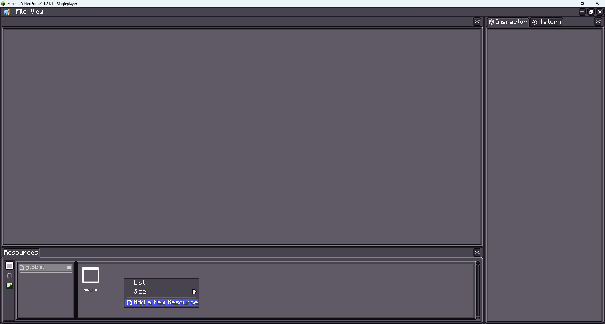

页面属性
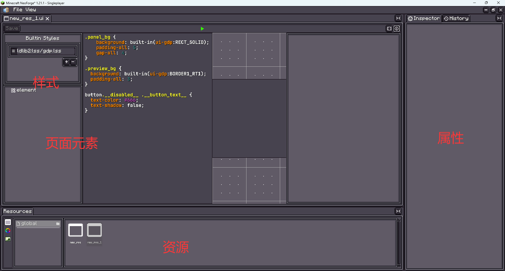

添加元素
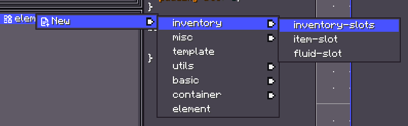

修改元素属性
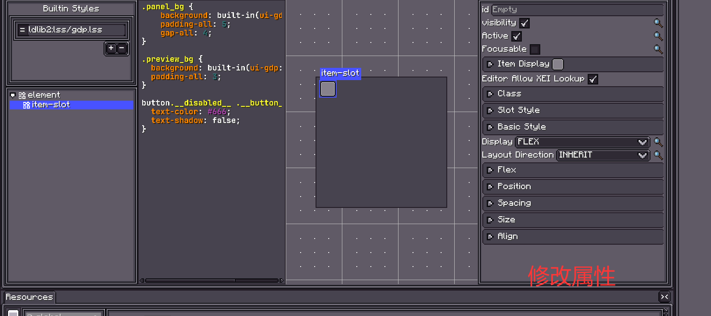

查看元素样式名称，方便编写样式表。
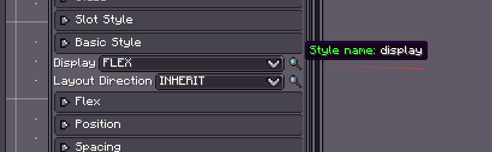

一个简单的两排物品栏位的UI
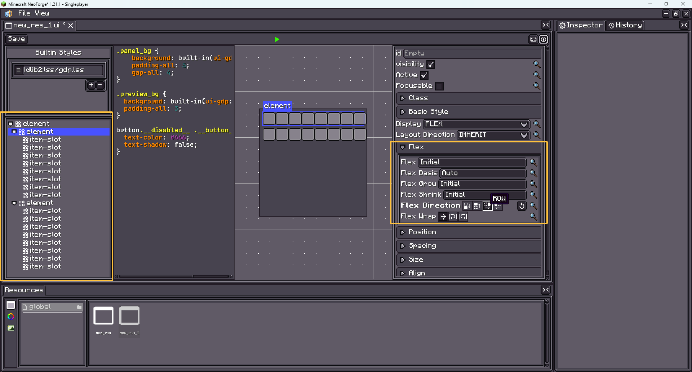

# xml

创建一个xml
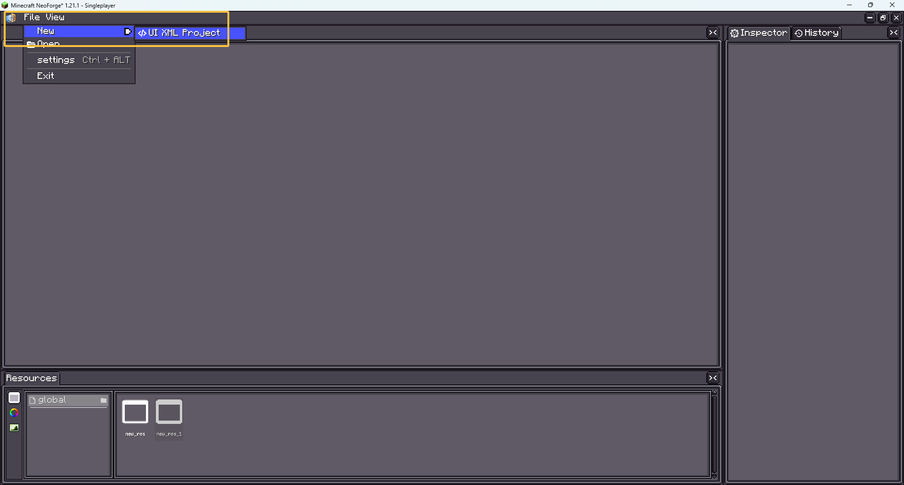

打开一个xml
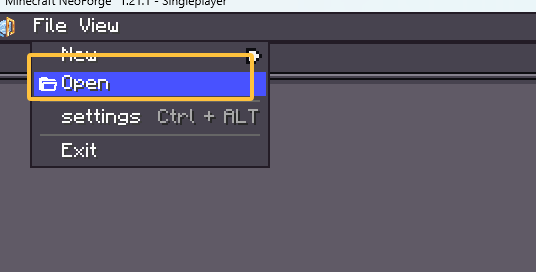


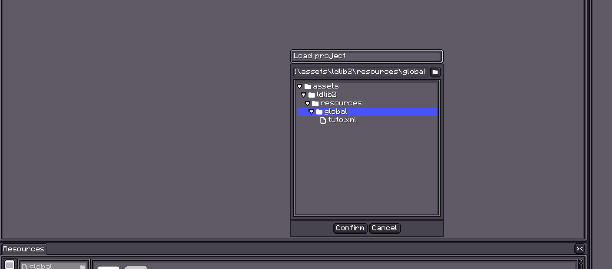

页面区域
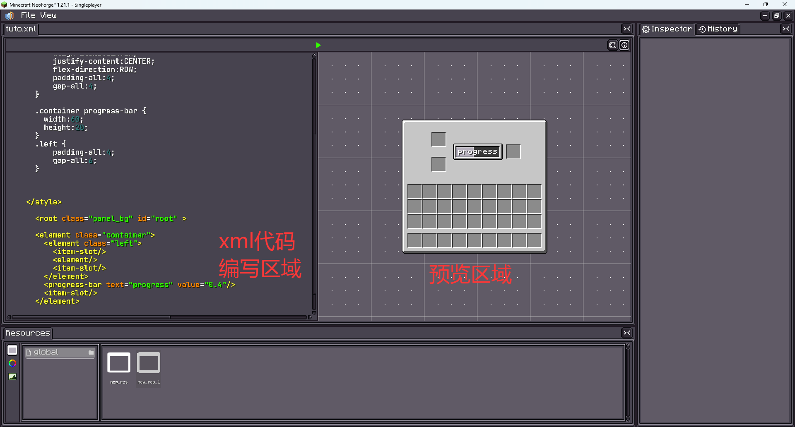

一个简单的类似熔炉的页面

```xml
<?xml version="1.0" encoding="UTF-8"?>
<ldlib2-ui xmlns:xsi="http://www.w3.org/2001/XMLSchema-instance"
           xsi:noNamespaceSchemaLocation="https://raw.githubusercontent.com/Low-Drag-MC/LDLib2/refs/heads/1.21/ldlib2-ui.xsd">
    <stylesheet location="ldlib2:lss/mc.lss"/>
    <style>
      #root{
          width: auto;
          height: auto;
//          background:  built-in(ui-gdp:BORDER);
          padding-all: 7;
          gap-all: 7;
      }

      .container{
          align-items:CENTER;
          justify-content:CENTER;
          flex-direction:ROW;
          padding-all:4;
          gap-all:4;
      }

      .container progress-bar {
        width:60;
        height:20;
      }
      .left {
          padding-all:4;
          gap-all:6;
      }


    
    </style>

      <root class="panel_bg" id="root" >

      <element class="container">
        <element class="left">
          <item-slot/>
          <element/>
          <item-slot/>       
        </element>    
        <progress-bar text="progress" value="0.4"/>
        <item-slot/>
      </element>
      
      <inventory-slots/>
      </root>
</ldlib2-ui>
```

如何查看元素在xml中名称
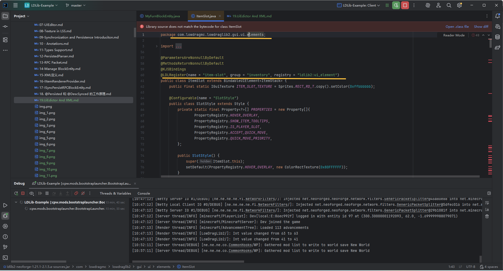


如何查看样式名称可以看上边的ui编辑的部分，样式支持那些属性也可以看上面的内容。

查看xml支持那些属性可以编写，查看loadxml方法即可。
```

  public void loadXml(Element element) {
      // 1. min-value - 最小值
      if (element.hasAttribute("min-value")) {
          setMinValue(XmlUtils.getAsFloat(element, "min-value", minValue));
      }
      // 2. max-value - 最大值
      if (element.hasAttribute("max-value", maxValue));
      }
      // 3. value - 当前进度值
      if (element.hasAttribute("value")) {
          setValue(XmlUtils.getAsFloat(element, "value", value));
      }
      // 4. text - 进度条上显示的文本
      if (element.hasAttribute("text")) {
          label.setText(element.getAttribute("text"));
      }
      super.loadXml(element);  // 还会调用父类的 loadXml
  }

  所以在 XML 中可以这样使用：

  <progress-bar
      min-value="0"
      max-value="100"
      value="50"
      text="50%"
      /* 其他继承自 UIElement 的属性 */
  />

```


